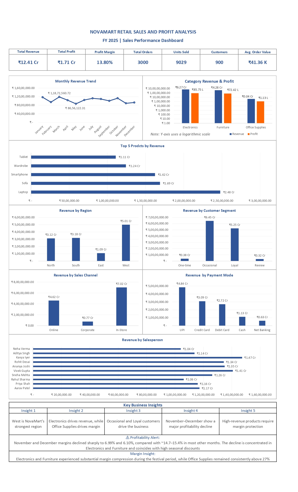

# NovaMart Retail Sales & Profit Analysis Dashboard

An Excel-based retail business analytics project that transforms
transaction-level sales data into actionable insights on revenue,
profitability, customers, products, regions, sales channels, and
seasonal performance.

## 📌 Project Overview

NovaMart Retail Sales & Profit Analysis Dashboard is an end-to-end
Microsoft Excel business analytics project designed to analyze retail
sales performance and identify key factors influencing revenue and
profitability.

The project analyzes 3,000 retail transactions across 900 customers
and 21 products for the period January–December 2025.

The analysis combines Excel formulas, structured tables, PivotTables,
PivotCharts, KPI calculations, and dashboard visualization to convert
raw transaction data into a consolidated business intelligence view.

## 🎯 Business Problem

Analyzing transaction-level retail data directly can make it difficult
to identify the factors influencing business performance.

The project addresses questions such as:

- Which products and categories generate the most revenue?
- Which products contribute the most profit?
- Which regions and cities perform strongly?
- Which customer segments contribute most to revenue?
- How do sales channels and payment methods perform?
- How does performance change throughout the year?
- Which products experience weak or negative profitability?
- How are seasonal promotions associated with changes in profit margins?

## 📊 Dataset

The project uses a structured retail transaction dataset covering:

- **3,000** transactions
- **900** customers
- **21** products
- **3** product categories
- **4** regions
- **12** cities
- **3** sales channels
- **5** payment modes
- **10** salespersons
- **January–December 2025**

The dataset includes transaction-level information such as order date,
customer, product, category, region, city, sales channel, payment mode,
quantity, revenue, cost, profit, customer type, and season.

## 🛠️ Tools & Skills

### Tools
- Microsoft Excel

### Excel Techniques
- Excel Tables & Structured References
- VLOOKUP
- IF / AND / OR
- SUMIFS
- COUNTIFS
- AVERAGEIFS
- Date-based analysis
- PivotTables
- PivotCharts
- Conditional Formatting
- KPI calculations
- Dashboard design
- Data validation & reconciliation

### Business Analytics
- Sales performance analysis
- Product & category analysis
- Customer segmentation
- Regional & city analysis
- Salesperson performance analysis
- Sales channel analysis
- Payment mode analysis
- Seasonal analysis
- Profitability investigation

## 📈 Dashboard Preview

The dashboard provides a consolidated view of NovaMart's business
performance through KPI cards, sales trends, product and category
analysis, customer segmentation, regional performance, sales channels,
payment methods, salesperson performance, and profitability insights.

## 🔍 Analysis Performed

The project covers the following analytical areas:

- **Overall Sales Performance** — Revenue, profit, margin, orders, units, and average order value.
- **Monthly Performance** — Monthly revenue, profit, orders, units, and profitability trends.
- **Product Analysis** — Product-level revenue, profit, units, and profit margins.
- **Category Analysis** — Performance comparison across Electronics, Furniture, and Office Supplies.
- **Customer Analysis** — Customer segments, purchasing frequency, revenue, and profit contribution.
- **Top Customer Analysis** — Identification of high-value customers by revenue and profit.
- **Regional & City Analysis** — Comparison of revenue and profitability across regions and cities.
- **Salesperson Analysis** — Revenue, profit, margin, orders, units, and average order value.
- **Sales Channel Analysis** — Performance across Online, In-Store, and Corporate channels.
- **Payment Mode Analysis** — Revenue and profitability across different payment methods.
- **Seasonal Analysis** — Comparison of regular and festival-period performance.
- **Profitability Investigation** — Investigation of the November–December decline in profit margins.

## 💡 Key Business Insights

### Overall Performance
- NovaMart generated approximately **₹12.41 Cr in revenue** and **₹1.71 Cr in profit** from 3,000 transactions.
- The overall profit margin was approximately **13.80%**.
- The average order value was approximately **₹41.36K**.

### Category Performance
- **Electronics** generated approximately **59.5% of total revenue**, making it the largest revenue category.
- **Furniture** contributed approximately **40.1% of revenue** and represented another major revenue driver.
- **Office Supplies** generated only about **0.4% of revenue**, but achieved the highest category margin at approximately **27.62%**.

### Customer Performance
- The **Occasional and Loyal** customer segments together contributed approximately **94.3% of total revenue**.
- The top 10 customers by revenue accounted for approximately **4.61% of total revenue**, indicating that revenue was not heavily concentrated among a small number of customers.

### Regional Performance
- The **West region** generated approximately **₹5.01 Cr in revenue**, representing about **40.4% of total revenue**.
- West also generated the highest absolute regional profit.

### Sales Performance
- **In-Store** sales generated the largest share of revenue at approximately **56.6%**.
- **UPI** was the largest payment mode by revenue, contributing approximately **₹4.84 Cr**.

### Product Performance
- **Laptop** was the largest revenue-generating product, contributing approximately **₹2.48 Cr**, or about **20% of total revenue**.
- Several smaller products, including Keyboard, Markers, Pen Set, and Earbuds, maintained substantially higher profit margins than some high-revenue products.

## ⚠️ Profitability Investigation

A deeper investigation was performed after identifying a significant
decline in profitability during November and December.

### November
- Revenue: approximately **₹8.91 Cr**
- Profit: approximately **₹62.31 L**
- Profit Margin: **6.99%**

### December
- Revenue: approximately **₹9.27 Cr**
- Profit: approximately **₹56.56 L**
- Profit Margin: **6.10%**

The investigation showed substantial margin compression across several
high-revenue Electronics and Furniture products.

Examples include:

| Product | Normal Margin | November Margin | December Margin |
|---|---:|---:|---:|
| Laptop | 12.06% | 4.71% | 3.06% |
| Tablet | 7.50% | 0.20% | 0.78% |
| Monitor | 5.02% | -1.38% | -2.05% |
| Sofa | 15.17% | 7.12% | 8.16% |
| Dining Table | 14.20% | 5.49% | 5.92% |
| Wardrobe | 13.69% | 3.75% | 5.63% |

The analysis also found that these products experienced relatively high
seasonal discounts during the same period. The observed relationship
suggests that aggressive seasonal discounting was associated with
substantial margin compression, particularly across high-revenue
Electronics and Furniture products.

The Monitor product became loss-making during both November and
December, with its margin declining to **-2.05% in December**.

